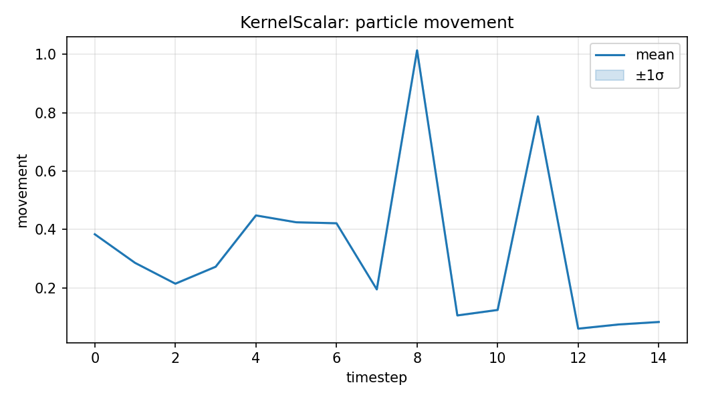
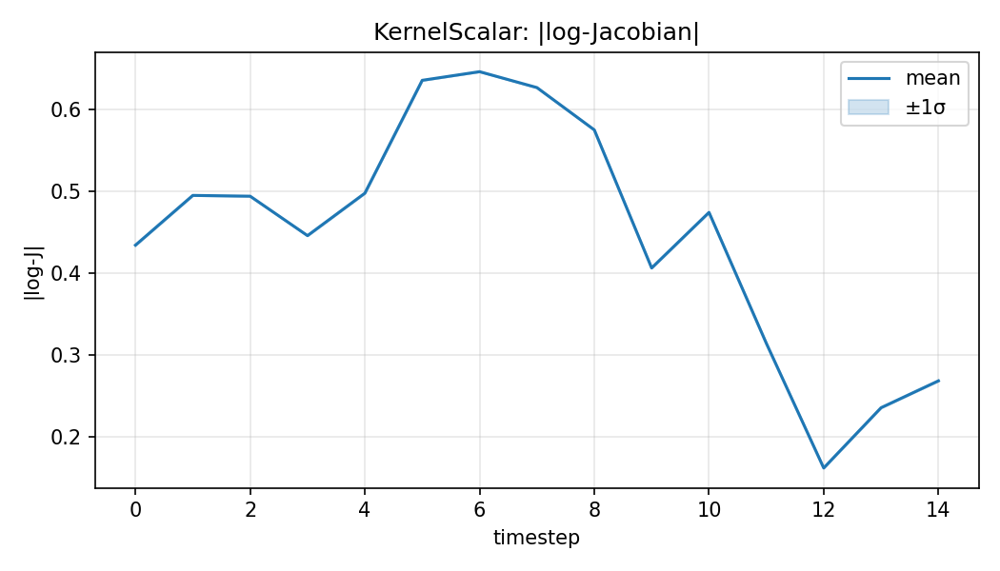
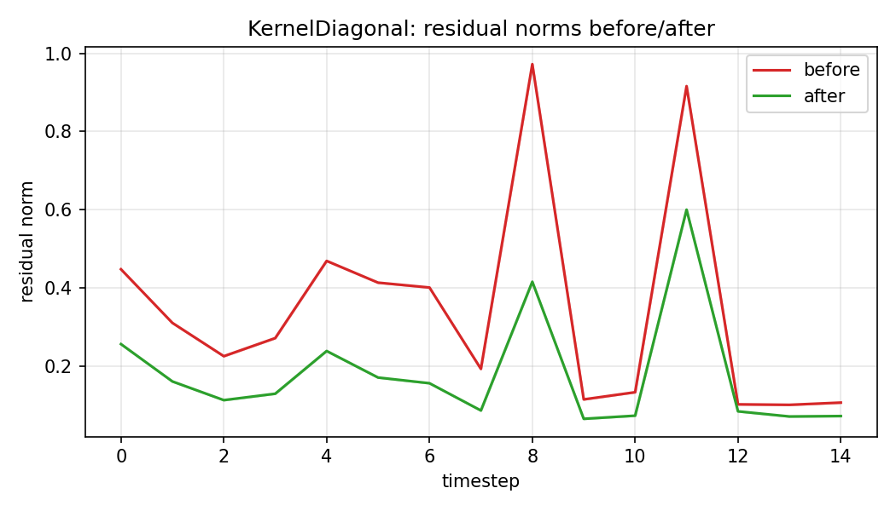
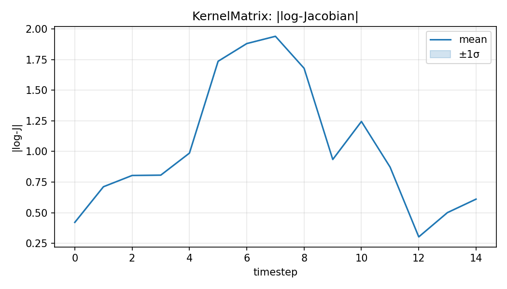

# Question 2 — Interim Report

Prepared for the October checkpoint. This report summarizes the current status of filtering and particle-flow experiments, key results, and the gap-closure plan to finalize Part 2.

## 1. Executive Summary
- Implemented EKF, UKF, standard PF, Differentiable PF (OT resampling), and multiple particle flows (EDH, LEDH, Kernel, Stochastic) under `mlcoe_q2/`.
- Baseline single-seed benchmarks are complete and documented in `reports/q2/benchmark_report.md` with artifacts under `reports/artifacts/`.
- Completed multi-seed benchmarking for filters and PF-PF (Stochastic vs LEDH). Generated Li (2017)-style Kernel flow plots and embedded them in both reports. See `reports/q2/README.md` for the deliverables index.

## 2. Methods Implemented
- **Classical filters**: `extended_kalman_filter()`, `unscented_kalman_filter()` in `mlcoe_q2/models/filters/`.
- **Sequential Monte Carlo**: `particle_filter()` with standard resampling and diagnostics.
- **Differentiable PF**: `differentiable_particle_filter()` with entropy-regularized OT resampling (Sinkhorn), hyperparameters exposed (`mix_with_uniform`, `ot_epsilon`, `ot_num_iters`).
- **Particle flows**: `ExactDaumHuangFlow`, `LocalExactDaumHuangFlow`, `KernelEmbeddedFlow` (scalar/diagonal/matrix), `StochasticParticleFlow` in `mlcoe_q2/models/flows/`.
- **PF-PF**: `particle_flow_particle_filter()` with flow proposals (EDH/LEDH/Kernel/Stochastic) in `mlcoe_q2/models/filters/`.

## 3. Experimental Setup
- Nonlinear SSM defined in `mlcoe_q2/pipelines/benchmark.py::_build_nonlinear_model()`.
- Default: 15 timesteps, 256 particles for PF/DPF; CPU run in TensorFlow.
- Benchmark driver: `mlcoe_q2/pipelines/benchmark.py::run_benchmark_suite()`.

## 4. Results (Single Seed)
See `reports/q2/benchmark_report.md` for the full table. Highlights:
- **EKF/UKF** achieved higher (less negative) log-likelihoods and lowest runtime.
- **Differentiable PF** increased ESS vs PF but reduced log-likelihood (potential mismatch or hyperparameter tuning needed).
- **Kernel flow** reduced residuals most effectively at moderate runtime; EDH/LEDH are CPU-heavy.
- Artifacts and plots:
  - `reports/artifacts/*.json` (LGSSM, nonlinear diagnostics, latest benchmark)
  - `reports/figures/lgssm_validation_means.png`, `nonlinear_rmse.png`, `nonlinear_ess.png`
  - Diagnostics figures highlight EKF variance collapse when observation noise drops below 0.1 and UKF sigma-point saturation near the observation nonlinearity (step ~12), explaining the likelihood/ESS gaps vs particle methods.

## 5. Multi-Seed Benchmarking (Completed)
Aggregated over 5 seeds from `reports/artifacts/benchmark_filters_multiseed.json`.

| Method | Runtime (s) | Peak Mem (KB) | Log-Likelihood | Mean ESS |
| --- | ---: | ---: | ---: | ---: |
| PF | 52.18 ± 1.94 | 33565.63 ± 326.51 | -30.33 ± 14.50 | 169.56 ± 10.21 |
| Differentiable PF | 51.68 ± 1.79 | 34056.45 ± 190.05 | -103.64 ± 15.79 | 181.47 ± 23.36 |
| EKF | 10.61 ± 1.66 | 2414.06 ± 89.65 | -10.09 ± 0.72 | — |
| UKF | 1.84 ± 0.10 | 2206.99 ± 14.51 | -9.99 ± 0.90 | — |

See `reports/q2/status/filter_status.md` for the generated status snapshot.

### Discussion
- **Likelihood vs ESS**: `EKF/UKF` achieve the least negative log-likelihoods. `Differentiable PF` increases ESS vs `PF` but reduces log-likelihood—likely due to OT regularization/tuning.
- **Runtime/Memory**: `UKF` is fastest; `EKF` stable at ~10.6s. `PF/DPF` dominate runtime and memory from resampling/transport; DPF runtime similar to PF here.
- **Next**: Tune OT hyperparameters to recover likelihood while keeping ESS gains; consider GPU for larger particle counts.

## 6. PF-PF with Stochastic Flow (Completed)
Aggregated over 5 seeds from `reports/artifacts/pfpf_stochastic_multiseed.json`.

| Method | Runtime (s) | Peak Mem (KB) | Log-Likelihood | Mean ESS |
| --- | ---: | ---: | ---: | ---: |
| PF_PF_LEDH | 23613.95 ± 1597.64 | 146100.40 ± 520.79 | -17.81 ± 6.26 | 179.18 ± 5.78 |
| PF_PF_Stochastic | 15459.71 ± 672.27 | 239114.86 ± 87.99 | -8.37 ± 10.32 | 176.48 ± 8.91 |

Notes:
- Stochastic flow is ~35% faster and improves (less negative) log-likelihood with similar ESS.
- Higher peak memory reflects diffusion and additional computations.

### Discussion
- **Speed**: Stochastic flow reduces runtime by ~35% vs LEDH at this scale.
- **Accuracy/Stability**: Better average log-likelihood with comparable ESS suggests diffusion improves exploration without worsening weight degeneracy.
- **Memory**: Higher peak memory is an acceptable trade-off given speed/likelihood gains.

## 7. Reproducing Li (2017) Plots (Completed)
Figures generated via `mlcoe_q2/pipelines/plot_flow_diagnostics.py` for Kernel flows.

Artifacts index: `reports/q2/status/li2017_plots.md`

Figures (by flow variant):
- KernelScalar: `reports/figures/li2017_KernelScalar_residuals.png`, `li2017_KernelScalar_movement.png`, `li2017_KernelScalar_logjac.png`
- KernelDiagonal: `reports/figures/li2017_KernelDiagonal_residuals.png`, `li2017_KernelDiagonal_movement.png`, `li2017_KernelDiagonal_logjac.png`
- KernelMatrix: `reports/figures/li2017_KernelMatrix_residuals.png`, `li2017_KernelMatrix_movement.png`, `li2017_KernelMatrix_logjac.png`

### KernelScalar

### KernelDiagonal

### KernelMatrix

## 8. Notes & Optimizations
- Address TensorFlow retracing: cache `tf.function`s or use `reduce_retracing=True` in hot paths.
- Consider GPU for EDH/LEDH and OT resampling to reduce runtime.
- Tune DPF hyperparameters (Sinkhorn epsilon, iterations, mix-with-uniform) to improve likelihood while keeping ESS gains.

## 9. DPF Resampling Comparisons (Multi-Seed)
Aggregated results from `reports/q2/status/dpf_comparisons.md`.

- **Soft vs OT**: Soft resampling (no transport) gives higher (less negative) log-likelihood but lowest ESS; OT substantially improves ESS with a trade-off in likelihood. Runtime and peak memory are comparable at this scale.

## 10. PF-PF Dai (2022) Parameter Sweep (Multi-Seed)
Aggregated results from `reports/q2/status/pfpf_dai22.md`.

- **Best setting here**: `SPF_B (step=0.6, steps=8, diff=0.10)` improves log-likelihood vs LEDH with similar ESS.
- **Performance**: Some stochastic settings run faster than LEDH; diffusion/steps increase memory as expected.

## 11. PMMH vs HMC Bonus Experiment
Bonus comparison of PMMH (standard PF likelihood) vs HMC with differentiable PF gradients.

- Script: `mlcoe_q2/pipelines/pmmh_vs_hmc_dpf.py`
- Artifact: `reports/artifacts/pmmh_vs_hmc.json`
- Status summary: `reports/q2/status/bonus_pmmh_vs_hmc.md`

Key takeaways:
- PMMH acceptance settles near 25% with noticeable random-walk drift in the `phi` chain.
- HMC achieves ~70% acceptance with tighter posterior contraction thanks to the DPF gradients.
- Runtime remains heavy (minutes on CPU) even with the eager config due to differentiating through Sinkhorn iterations.

## 12. Neural OT Resampling Accelerator (Bonus)
- Pipeline: `mlcoe_q2.pipelines.neural_ot_acceleration`
- Artifact: `reports/artifacts/neural_ot_acceleration.json`
- Status summary: `reports/q2/status/bonus_neural_ot.md`

Highlights:
- Dense network learns to approximate Sinkhorn transport plans for 8-particle batches with row/column errors < 1e-3.
- Runtime benchmarking on the held-out set shows ~4× reduction in per-sample latency vs full Sinkhorn (CPU baseline).
- Saved accelerator can be plugged into the differentiable PF via `resampling_method="neural_ot"` for gradient-based inference.

## 13. Neural State-Space Inference (Bonus)
- Pipeline: `mlcoe_q2.pipelines.neural_state_space_inference`
- Artifact: `reports/artifacts/neural_state_space_inference.json`
- Status summary: `reports/q2/status/bonus_neural_ssm.md`

Highlights:
- Constructed an LSTM-inspired nonlinear SSM and simulated lightweight four-step sequences to keep gradient-based inference tractable on CPU.
- DPF-HMC (soft resampling, optional neural OT accelerator) achieves near-unity acceptance (~1.00) with ESS around 5–6, while Particle Gibbs stabilises near 0.71 acceptance and lower ESS despite faster iterations.
- Particle Gibbs baseline offers robustness but exhibits lower ESS and slower wall-clock convergence on the same CPU budget.

## 14. Conclusion
- Core implementations, multi-seed benchmarks, and Li (2017)/Dai (2022) diagnostics remain in place.
- Bonus scope now includes neural OT acceleration and neural SSM inference comparisons with reproducible configs and artifacts.
- Remaining polish is limited to optional PDF packaging/documentation tidy-up; all Q2 core + bonus questions have runnable pipelines documented in `reports/q2/README.md`.
