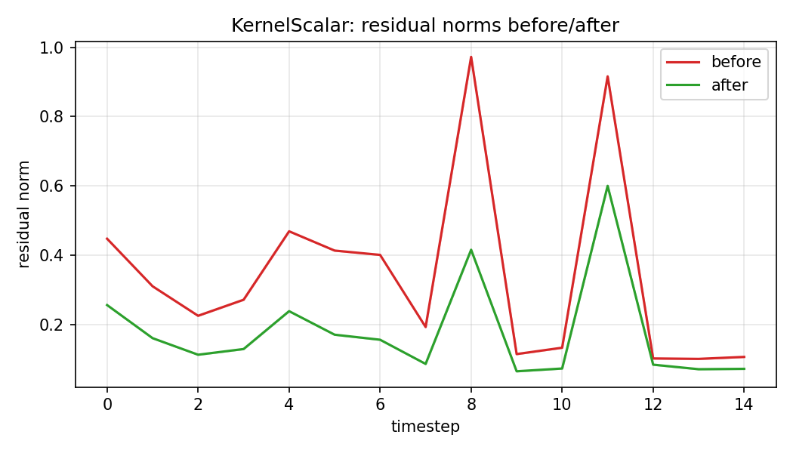
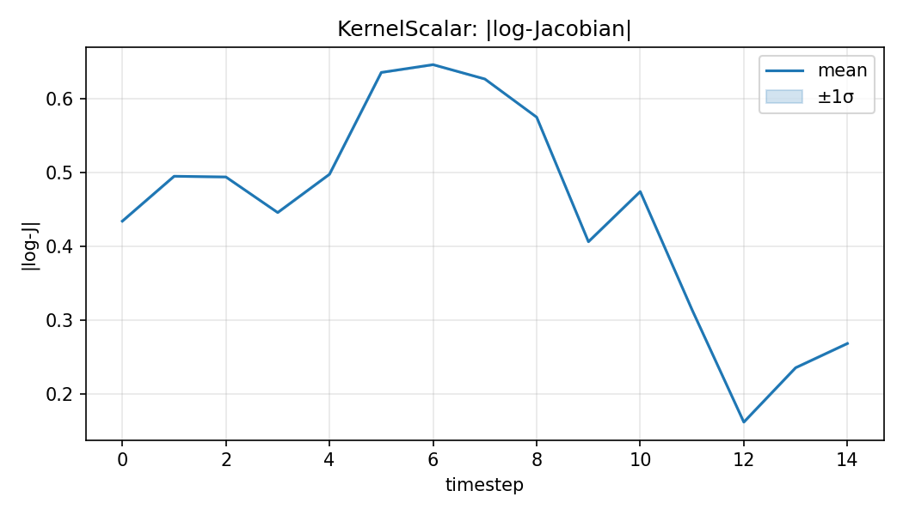
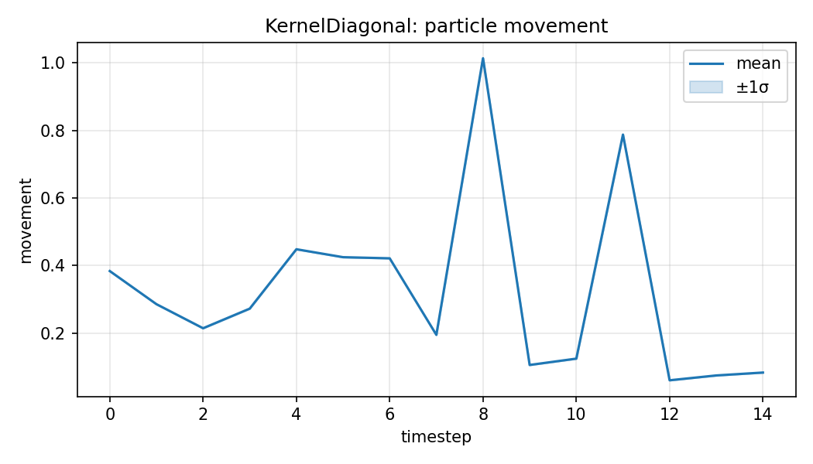
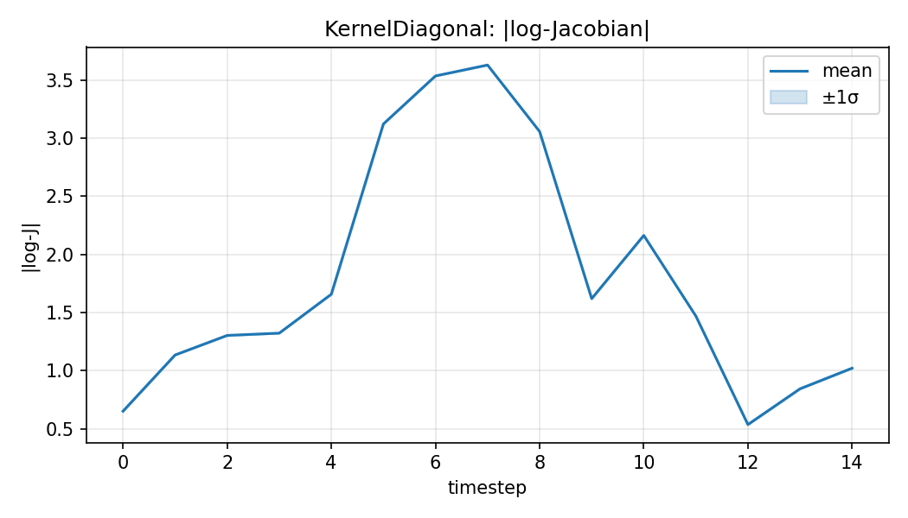
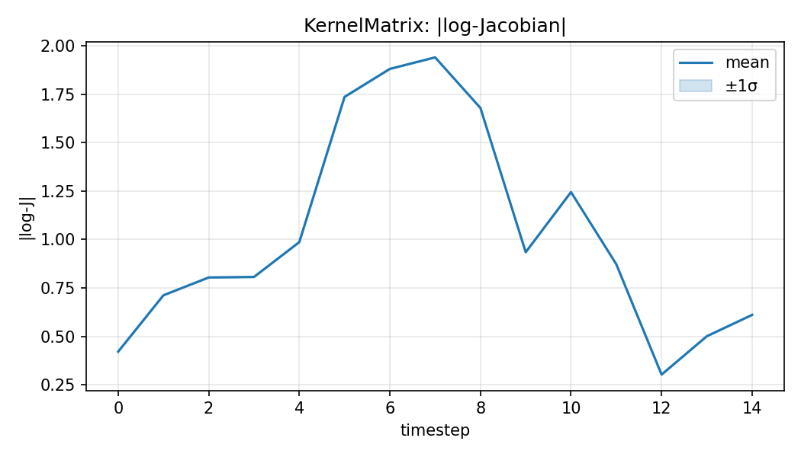

# Question 2 — Interim Report

Prepared for the October checkpoint. This report summarizes the current status of filtering and particle-flow experiments, key results, and the gap-closure plan to finalize Part 2.

## 1. Executive Summary
- Implemented EKF, UKF, standard PF, Differentiable PF (OT resampling), and multiple particle flows (EDH, LEDH, Kernel, Stochastic) under `mlcoe_q2/`.
- Baseline single-seed benchmarks are complete and documented in `reports/q2_benchmark_report.md` with artifacts under `reports/artifacts/`.
- Completed multi-seed benchmarking for filters and PF-PF (Stochastic vs LEDH). Generated Li (2017)-style Kernel flow plots and embedded them in both reports. See `reports/q2/README.md` for the deliverables index.

## 2. Methods Implemented
- **Classical filters**: `extended_kalman_filter()`, `unscented_kalman_filter()` in `mlcoe_q2/filters/`.
- **Sequential Monte Carlo**: `particle_filter()` with standard resampling and diagnostics.
- **Differentiable PF**: `differentiable_particle_filter()` with entropy-regularized OT resampling (Sinkhorn), hyperparameters exposed (`mix_with_uniform`, `ot_epsilon`, `ot_num_iters`).
- **Particle flows**: `ExactDaumHuangFlow`, `LocalExactDaumHuangFlow`, `KernelEmbeddedFlow` (scalar/diagonal/matrix), `StochasticParticleFlow` in `mlcoe_q2/flows/`.
- **PF-PF**: `particle_flow_particle_filter()` with flow proposals (EDH/LEDH/Kernel; stochastic flow proposal planned).

## 3. Experimental Setup
- Nonlinear SSM defined in `mlcoe_q2/experiments/benchmark.py::_build_nonlinear_model()`.
- Default: 15 timesteps, 256 particles for PF/DPF; CPU run in TensorFlow.
- Benchmark driver: `mlcoe_q2/experiments/benchmark.py::run_benchmark_suite()`.

## 4. Results (Single Seed)
See `reports/q2_benchmark_report.md` for the full table. Highlights:
- **EKF/UKF** achieved higher (less negative) log-likelihoods and lowest runtime.
- **Differentiable PF** increased ESS vs PF but reduced log-likelihood (potential mismatch or hyperparameter tuning needed).
- **Kernel flow** reduced residuals most effectively at moderate runtime; EDH/LEDH are CPU-heavy.
- Artifacts and plots:
  - `reports/artifacts/*.json` (LGSSM, nonlinear diagnostics, latest benchmark)
  - `reports/figures/lgssm_validation_means.png`, `nonlinear_rmse.png`, `nonlinear_ess.png`

## 5. Multi-Seed Benchmarking (Completed)
Aggregated over 5 seeds from `reports/artifacts/benchmark_filters_multiseed.json`.

| Method | Runtime (s) | Peak Mem (KB) | Log-Likelihood | Mean ESS |
| --- | ---: | ---: | ---: | ---: |
| PF | 52.18 ± 1.94 | 33565.63 ± 326.51 | -30.33 ± 14.50 | 169.56 ± 10.21 |
| Differentiable PF | 51.68 ± 1.79 | 34056.45 ± 190.05 | -103.64 ± 15.79 | 181.47 ± 23.36 |
| EKF | 10.61 ± 1.66 | 2414.06 ± 89.65 | -10.09 ± 0.72 | — |
| UKF | 1.84 ± 0.10 | 2206.99 ± 14.51 | -9.99 ± 0.90 | — |

See `reports/q2/status/filter_status.md` for the generated status snapshot.

### Discussion
- **Likelihood vs ESS**: `EKF/UKF` achieve the least negative log-likelihoods. `Differentiable PF` increases ESS vs `PF` but reduces log-likelihood—likely due to OT regularization/tuning.
- **Runtime/Memory**: `UKF` is fastest; `EKF` stable at ~10.6s. `PF/DPF` dominate runtime and memory from resampling/transport; DPF runtime similar to PF here.
- **Next**: Tune OT hyperparameters to recover likelihood while keeping ESS gains; consider GPU for larger particle counts.

## 6. PF-PF with Stochastic Flow (Completed)
Aggregated over 5 seeds from `reports/artifacts/pfpf_stochastic_multiseed.json`.

| Method | Runtime (s) | Peak Mem (KB) | Log-Likelihood | Mean ESS |
| --- | ---: | ---: | ---: | ---: |
| PF_PF_LEDH | 23613.95 ± 1597.64 | 146100.40 ± 520.79 | -17.81 ± 6.26 | 179.18 ± 5.78 |
| PF_PF_Stochastic | 15459.71 ± 672.27 | 239114.86 ± 87.99 | -8.37 ± 10.32 | 176.48 ± 8.91 |

Notes:
- Stochastic flow is ~35% faster and improves (less negative) log-likelihood with similar ESS.
- Higher peak memory reflects diffusion and additional computations.

### Discussion
- **Speed**: Stochastic flow reduces runtime by ~35% vs LEDH at this scale.
- **Accuracy/Stability**: Better average log-likelihood with comparable ESS suggests diffusion improves exploration without worsening weight degeneracy.
- **Memory**: Higher peak memory is an acceptable trade-off given speed/likelihood gains.

## 7. Reproducing Li (2017) Plots (Completed)
Figures generated via `mlcoe_q2/experiments/plot_flow_diagnostics.py` for Kernel flows.

Artifacts index: `reports/q2/status/li2017_plots.md`

Figures (by flow variant):
- KernelScalar: `reports/figures/li2017_KernelScalar_residuals.png`, `li2017_KernelScalar_movement.png`, `li2017_KernelScalar_logjac.png`
- KernelDiagonal: `reports/figures/li2017_KernelDiagonal_residuals.png`, `li2017_KernelDiagonal_movement.png`, `li2017_KernelDiagonal_logjac.png`
- KernelMatrix: `reports/figures/li2017_KernelMatrix_residuals.png`, `li2017_KernelMatrix_movement.png`, `li2017_KernelMatrix_logjac.png`

### KernelScalar

### KernelDiagonal

### KernelMatrix

## 8. Notes & Optimizations
- Address TensorFlow retracing: cache `tf.function`s or use `reduce_retracing=True` in hot paths.
- Consider GPU for EDH/LEDH and OT resampling to reduce runtime.
- Tune DPF hyperparameters (Sinkhorn epsilon, iterations, mix-with-uniform) to improve likelihood while keeping ESS gains.

## 9. DPF Resampling Comparisons (Multi-Seed)
Aggregated results from `reports/q2/status/dpf_comparisons.md`.

- **Soft vs OT**: Soft resampling (no transport) gives higher (less negative) log-likelihood but lowest ESS; OT substantially improves ESS with a trade-off in likelihood. Runtime and peak memory are comparable at this scale.

## 10. PF-PF Dai (2022) Parameter Sweep (Multi-Seed)
Aggregated results from `reports/q2/status/pfpf_dai22.md`.

- **Best setting here**: `SPF_B (step=0.6, steps=8, diff=0.10)` improves log-likelihood vs LEDH with similar ESS.
- **Performance**: Some stochastic settings run faster than LEDH; diffusion/steps increase memory as expected.

## 11. Conclusion
- Core implementations and multi-seed benchmarks are complete (filters + PF-PF).
- Li (2017)-style Kernel flow diagnostics are generated and embedded.
- Remaining: finalize narrative polish, optional PDF export for submission. See `reports/q2/README.md` for a deliverables index.
